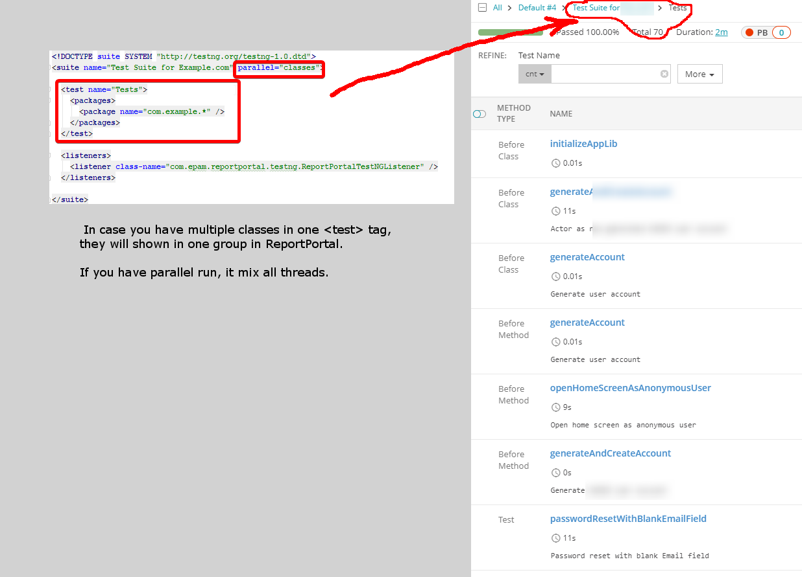
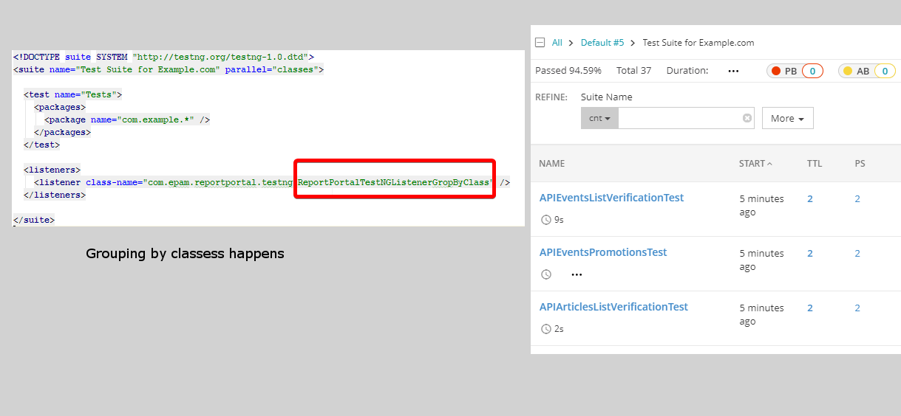

# client-java-testng
[](https://travis-ci.org/reportportal/agent-java-testNG)
[  ](https://bintray.com/epam/reportportal/agent-java-testng/_latestVersion)
 
[](https://reportportal-slack-auto.herokuapp.com)
[](http://stackoverflow.com/questions/tagged/reportportal)
[](https://rpp.uservoice.com/forums/247117-report-portal)
[](http://reportportal.io?style=flat)

## Listeners
#### ReportPortalTestNGListener
This listener works well if you does not use testng.xml, or if you have well-structured tests in testng.xml.
In case in your testng.xml, in test tag, you have multiple classes, this listener will save them 
all in one group, use ReportPortalTestNGListenerGropByClass listener in this case.



#### ReportPortalTestNGListenerGropByClass 
This class ignores test tag and group tests by class name instead. Use it in case you have single test tag in testng.xml that refer to multiple test classes.



##### Override UUID in run-time
```java
import com.epam.reportportal.guice.Injector;
import com.epam.reportportal.guice.ConfigurationModule;
import com.epam.reportportal.guice.ReportPortalClientModule;
import com.epam.reportportal.utils.properties.PropertiesLoader;
import rp.com.google.inject.Module;
import rp.com.google.inject.util.Modules;


public class MyListener extends ReportPortalTestNGListener {
    public MyListener() {
        super(Injector.create(Modules.combine(Modules.override(new ConfigurationModule())
                        .with(new Module() {
                            @Override
                            public void configure(Binder binder) {
                                Properties overrides = new Properties();
                                overrides.setProperty(ListenerProperty.UUID.getPropertyName(), "my crazy uuid");
                                PropertiesLoader propertiesLoader = PropertiesLoader.load();
                                propertiesLoader.overrideWith(overrides);
                                binder.bind(PropertiesLoader.class).toInstance(propertiesLoader);
                            }
                        }),
                new ReportPortalClientModule()
        )));
    }
}
```
